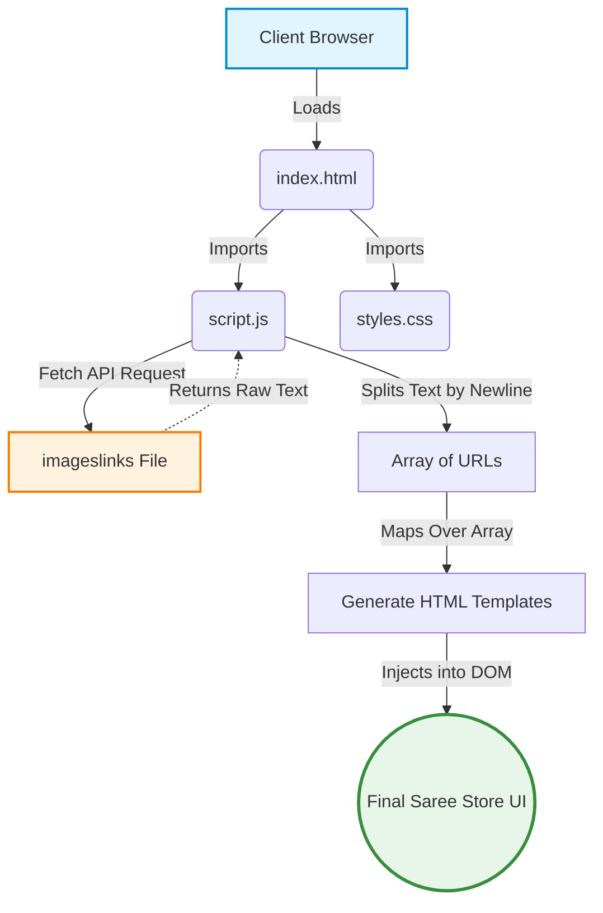
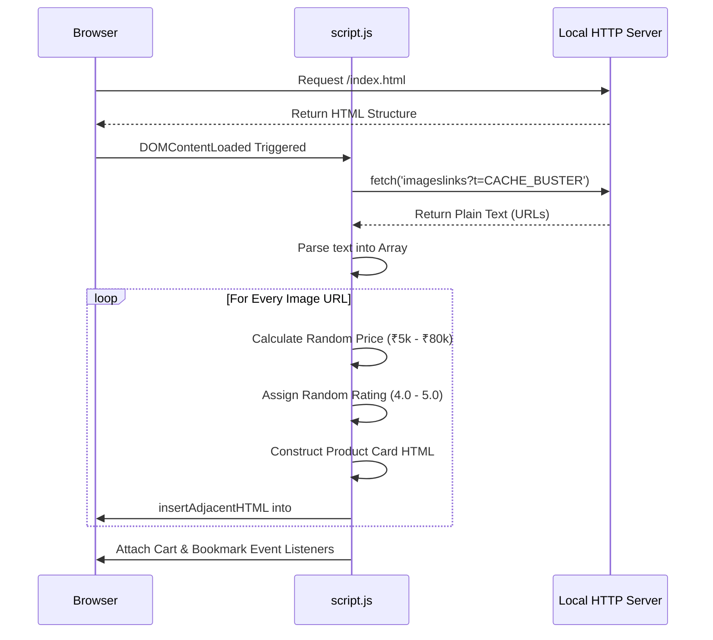
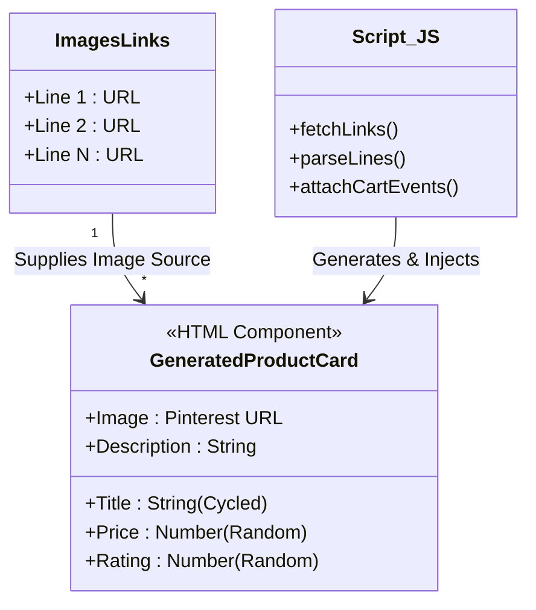

# 🥻 Saree Store Dynamic Catalog

A premium, elegant Saree Store frontend built with vanilla HTML, CSS, and JavaScript. It features a dynamically generated product catalog powered by a simple text file.

##  System Architecture & Workflow

This project is designed to be incredibly easy to update. Instead of hardcoding product cards into the HTML, the website reads from a local text file and generates the UI on the fly.

### 1. High-Level Data Pipeline
Here is a flowchart demonstrating how raw URLs are transformed into the final User Interface.



### 2. Execution Sequence
The following sequence diagram outlines exactly what happens the moment you open the website in your browser.



### 3. Component Structure
Each product card is built dynamically. Here is a visual representation of how the `imageslinks` file provides data for the generated components.



##  Running the Project Locally

1. Open your terminal in the project folder.
2. Start a local server:
   ```bash
   python3 -m http.server 8000
   ```
3. Open your browser and navigate to `http://localhost:8000`.
